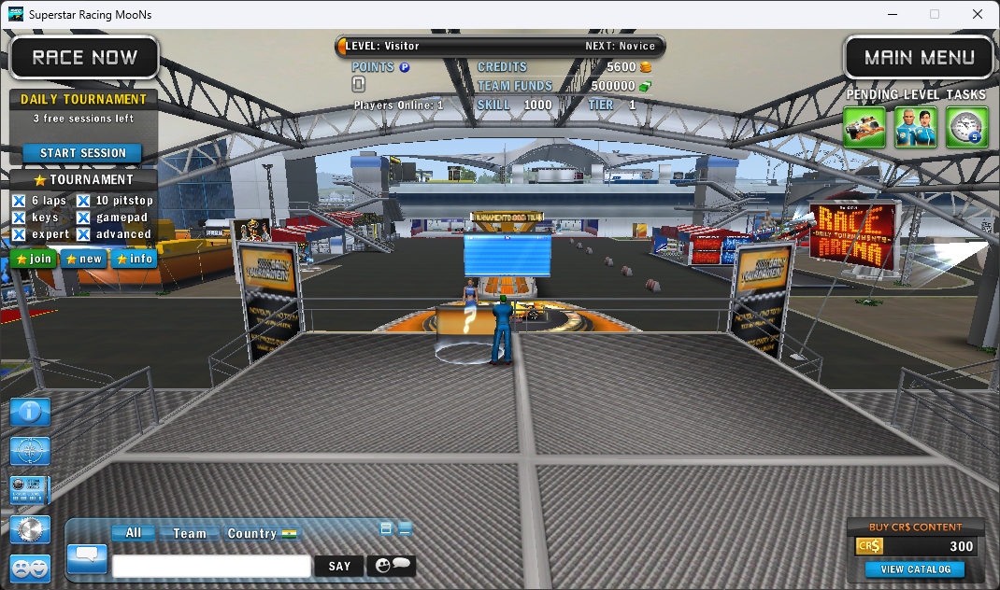
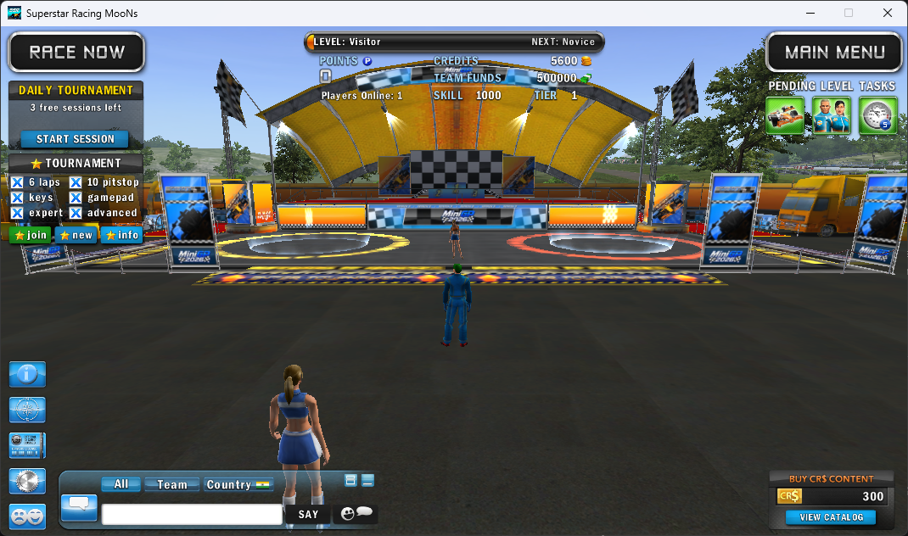
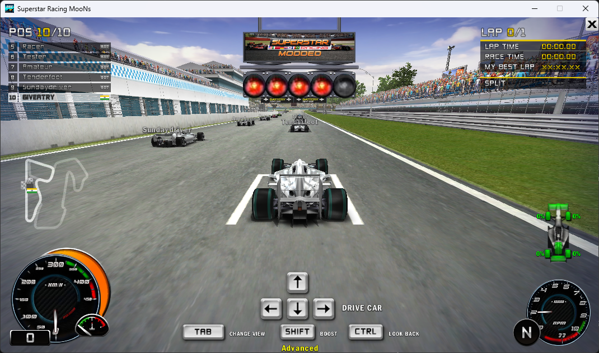

# Superstar Racing MooNs

Community multiplayer racing for Superstar Racing, hosted continuously on AWS.

Working now : Stricter DT/GP/Arena anti-cheat, and player POV-only lounge customization with limits and finally DT/GP/Arena with cheats with dedicated leaderboards.

> Download the client, start the launcher, and create an account or sign in inside the game.

> **Version 1.4.17:** Restores original-style GP/tournament award animations and a separate overhead medal row, and adds server-side race-result validation, approved-build integrity reporting, pseudonymous device enforcement, and anti-cheat audit controls.

<table>
  <tr>
    <td width="33.33%"></td>
    <td width="33.33%"></td>
    <td width="33.33%"></td>
  </tr>
  <tr align="center">
    <td><strong>Main Lobby</strong></td>
    <td><strong>Mini GP Lobby</strong></td>
    <td><strong>Circuit Racing</strong></td>
  </tr>
</table>

## Quick start

### 1. Download and extract the game

1. Open this repository's [Releases](../../releases/latest) page.
2. Download **Superstar-Racing-Player.zip** from the latest release.
3. Right-click the ZIP and select **Extract All**.
4. Open the extracted **Superstar Racing MooNs** folder.

Do not run the launcher from inside the ZIP.

### 2. Start the player launcher

Run **superstar-racing-launcher.exe**. Do not start `Superstar Racing.exe` directly.

Select **Play Now**. Use the native game screen to create an account or sign in
with your username/email and password.

### Verify the v1.4.17 download

SHA-256 for **Superstar-Racing-Player.zip**:

`1F46D7D0B67FBCAA0607F27D20C301EE7D8465DE336255E596ACD5ED3ABB5A9F`

## Every time you play

1. Make sure your computer is connected to the internet.
2. Run `superstar-racing-launcher.exe`.
3. Select **Play Now** and sign in through the native game login screen.

## Updates and player requests

The launcher checks this repository for new releases. When an update is available,
select **Update** in `superstar-racing-launcher.exe`; it verifies the published
SHA-256 digest, installs the package, preserves local settings, and restarts itself.

Every updated client version, compatibility improvement, and new gameplay patch
will also be published in this repository's [Releases](../../releases/latest)
section. Download updates only from this official repository.

Superstar Racing MooNs is free to play. Players never need to pay real money to request available in-game content or currency or for servers. You may privately request:

- Outfits and character items
- Car bodies and available vehicle content
- Additional CR$

Send the request with your exact in-game name to Discord `@iamsicknow` or Telegram `@wanderbotnow`. Valid requests will be added within 24 hours. Never include your password in a content request.

### Want your own private setup?

If you are interested in running a separate private game setup with its own server, contact the owner on Discord `@iamsicknow` or Telegram `@wanderbotnow`. We can discuss whether a private setup is suitable for you, and the owner may help guide you through the setup process. Availability and requirements are discussed privately.

## Troubleshooting

### Player login failed: server is offline

- Confirm your internet connection is working.
- Allow the launcher and game through local firewall or antivirus prompts.
- Ask the owner to check the AWS game service status.

### The game asks for the official retail launcher

Close the message and start `superstar-racing-launcher.exe` from the extracted game folder.

### Windows SmartScreen appears

The community launcher is not code-signed and performs runtime compatibility patching, so some antivirus products may show a heuristic false positive. Release ZIPs are checked locally with Microsoft Defender before publication; the result can still vary with future security-intelligence updates.

No developer can guarantee identical results from every antivirus engine or future signature update. Do not disable antivirus protection. Verify the SHA-256 checksum shown on the GitHub release, download only from this repository, and contact the owner if security software blocks the client.

## Security and privacy

- The published player package contains no database credentials, admin interface, or server source code.
- Public access is limited to the game, account, and read-only player-state services. The admin interface and database are not exposed publicly.
- Native game passwords remain private and are not included in the downloadable package.
- Hardware enforcement uses a one-way pseudonymous device digest; raw Windows machine identifiers are not transmitted or stored.
- Race rewards, progression, and leaderboard submissions are validated server-side. Client integrity signals are supporting evidence and are retained for administrator review.

Please report security concerns privately as described in [SECURITY.md](SECURITY.md).

## License and game content

Original repository documentation and supporting project material are licensed under the [MIT License](LICENSE).

Superstar Racing game executables, data files, artwork, names, trademarks, and other third-party material included in downloadable release assets are **not relicensed under MIT**. They remain the property of their respective owner(s) and are redistributed with permission. See [THIRD_PARTY_NOTICE.md](THIRD_PARTY_NOTICE.md).
