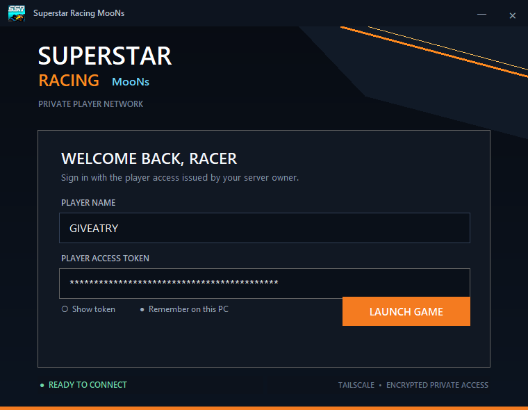

# Superstar Racing MooNs

Private multiplayer racing for the Superstar Racing community, delivered through an encrypted Tailscale network.
Working now : Covering Guest removal, Skills/Relogin work, stricter DT/GP/Arena anti-cheat, and player POV-only lounge customization with limits and finally DT/GP/Arena with cheats with dedicated leaderboards.

> Access is invitation-only. The game server is hosted continuously on AWS and is reachable only through Tailscale.

> **Version 1.1.0:** The game host has moved to AWS. Existing players must request the new private Tailscale machine-share invitation and install the v1.1.0 client; v1.0.0 points to the retired owner-machine address.

<table>
  <tr>
    <td width="33.33%"></td>
    <td width="33.33%"></td>
    <td width="33.33%"></td>
  </tr>
  <tr align="center">
    <td><strong>Main Lobby</strong></td>
    <td><strong>Mini GP Lobby</strong></td>
    <td><strong>Circuit Racing</strong></td>
  </tr>
</table>

## Original game and ownership

Superstar Racing MooNs is a community-patched version of [Superstar Racing Modded]. All rights to the original game, its branding, and its assets remain with respective rights holders. This community project does not claim ownership of the original game.

## Before you download

Request these items privately from the server owner:

1. A **Tailscale machine-share invitation link**.
2. Your **player name**.
3. Your unique **player access token**.
4. Your in-game account credentials, if the owner created them separately.

Request access privately through either of these official contacts:

- **Discord:** `@iamsicknow`
- **Telegram:** `@wanderbotnow`

Never post an invitation link, access token, or password in a GitHub issue, screenshot, Discord channel, or other public location.

## Quick start

### 1. Connect through Tailscale

1. Download and install [Tailscale for Windows](https://tailscale.com/download/windows).
2. Sign in to Tailscale with your own account.
3. Open the private machine-share link supplied by the server owner and accept it.
4. Confirm that the shared game host appears online in Tailscale.

The client cannot connect unless Tailscale is running and the private AWS game host is online.

### 2. Download and extract the game

1. Open this repository's [Releases](../../releases/latest) page.
2. Download **Superstar Racing MooNs.zip** from the latest release.
3. Right-click the ZIP and select **Extract All**.
4. Open the extracted **Superstar Racing MooNs** folder.

Do not run the launcher from inside the ZIP.

### 3. Start the player launcher

Run **superstar-racing-launcher.exe**. Do not start `Superstar Racing.exe` directly.

Enter the private values issued to you:

- **Player Name** — your server profile name.
- **Player Access Token** — your unique launcher token.
- **Remember on this PC** — keeps the token on your Windows account for later launches.

Select **Launch Game**.

### 4. Complete the first launch

On a clean installation, the first start performs a one-time game-file verification and guest bootstrap. When it reaches the lobby, close the game normally.

Start **superstar-racing-launcher.exe** again. Later starts open the native game login screen directly. Enter the in-game username/email and password supplied or registered for your account.

## Every time you play

1. Start Tailscale and verify the shared host is online.
2. Run `superstar-racing-launcher.exe`.
3. Confirm your player name and access token.
4. Select **Launch Game** and sign in through the native game login screen.

## Updates and player requests

Every updated client version, compatibility improvement, and new gameplay patch will be published in this repository's [Releases](../../releases/latest) section. Download updates only from this official repository.

Superstar Racing MooNs is free to play. Players never need to pay real money to request available in-game content or currency. You may privately request:

- Outfits and character items
- Car bodies and available vehicle content
- Additional CR$

Send the request with your exact player name to Discord `@iamsicknow` or Telegram `@wanderbotnow`. Valid requests will be added within 24 hours. Never include your password or player access token in a content request.

### Want your own private setup?

If you are interested in running a separate private game setup with its own server, contact the owner on Discord `@iamsicknow` or Telegram `@wanderbotnow`. We can discuss whether a private setup is suitable for you, and the owner may help guide you through the setup process. Availability and requirements are discussed privately.

## Troubleshooting

### Player login failed: server is offline

- Confirm Tailscale is connected.
- Confirm you accepted the owner's machine-share invitation.
- Confirm the shared host is online.
- Ask the owner to check the AWS game service status.

### Unauthorized or invalid player access token

- Check that the player name matches exactly.
- Paste the complete token without spaces.
- Ask the owner to issue a replacement token if yours was rotated or exposed.

### The game asks for the official retail launcher

Close the message and start `superstar-racing-launcher.exe` from the extracted game folder.

### Windows SmartScreen appears

The community launcher is not code-signed and performs runtime compatibility patching, so some antivirus products may show a heuristic false positive. The final v1.1.0 folder and ZIP were scanned locally with Microsoft Defender on August 28, 2026 (security intelligence version `1.457.370.0`) and produced no detections.

No developer can guarantee identical results from every antivirus engine or future signature update. Do not disable antivirus protection. Verify the SHA-256 checksum shown on the GitHub release, download only from this repository, and contact the owner if security software blocks the client.

## Security and privacy

- The published player package contains no database credentials, admin interface, or server source code.
- The AWS game server and player API are reachable only through the private Tailscale connection.
- Player access tokens are unique and can be revoked individually.
- Selecting **Remember on this PC** stores the token under the current Windows user profile. Do not enable it on a shared computer.

Please report security concerns privately as described in [SECURITY.md](SECURITY.md).

## License and game content

Original repository documentation and supporting project material are licensed under the [MIT License](LICENSE).

Superstar Racing game executables, data files, artwork, names, trademarks, and other third-party material included in downloadable release assets are **not relicensed under MIT**. They remain the property of their respective owner(s) and are redistributed with permission. See [THIRD_PARTY_NOTICE.md](THIRD_PARTY_NOTICE.md).
